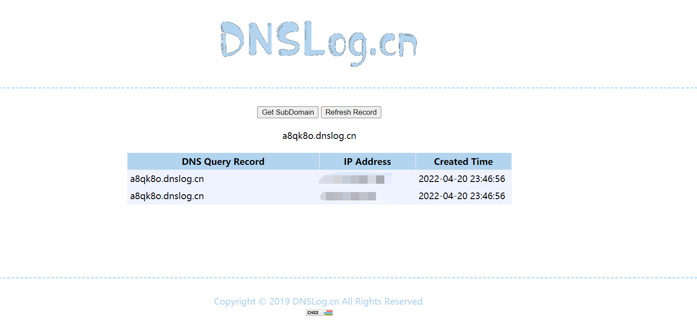

# TOTOLINK A3600R Vuln

Author：dota_st

Target：http://www.totolink.cn/home/menu/detail.html?menu_listtpl=download&id=63&ids=36

Version：TOTOLINK A3600R

Submit date: 2022-04-20

## 1.command execution

There is a vulnerability in the `setWebWlanIdx` function in the `squashfs-root\lib\cste_modules\wireless.so` file. The incoming `setWebWlanIdx` parameter is spliced into the variable `v7`, and finally the `CsteSystem` function executes the command on `v7`

Can execute commands without echo in the foreground

## 2.command execution

There is a vulnerability in the `setLanguageCfg` function in the `squashfs-root\lib\cste_modules\global.so` file, the passed in `langType` parameter is spliced into the variable `v9`, and finally the `CsteSystem` function executes the command on `v9`

